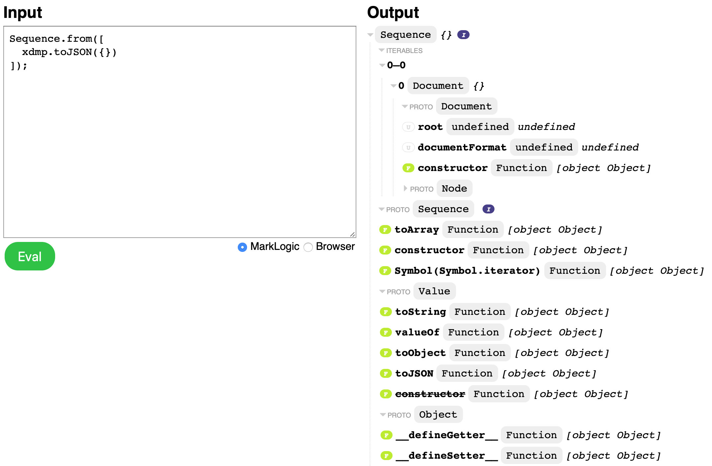

# MarkLogic Prototype

A prototype visualization of JavaScript object hierarchies in MarkLogic or the browser.



## Requirements

* [MarkLogic 9](https://developer.marklogic.com/products)
* [Node.js 10](https://nodejs.org/en/download/)

## Install

MacOS:

```shell
git clone https://github.com/jmakeig/object-describe.git
cd object-describe/marklogic-describe
npm install
```

## Run

MacOS:

```shell
npm start -- marklogic --user 'sally' --pass '********'
open http://localhost:3000/
```

Start the web server that connects to MarkLogic via port and host. 

```text
Usage:
  npm start -- [--port=<port>]
  npm start -- [--port=<port>] marklogic [--host=<host>] [--user=<user>] [--pass=<pass>]

Options:
  --port=<port>     Port to listen on [default: 3000]
  marklogic:
    --host=<host>   MarkLogic host to connect to [default: localhost]
    --user=<user>   MarkLogic user name
    --pass=<pass>   MarkLogic password
```

## Develop

In development you’ll need to run `npm run build` *in the parent directory* to build the `describe.js` and `render.js` packages from source. For better or worse, these are checked in, so you don’t need to build them initially.